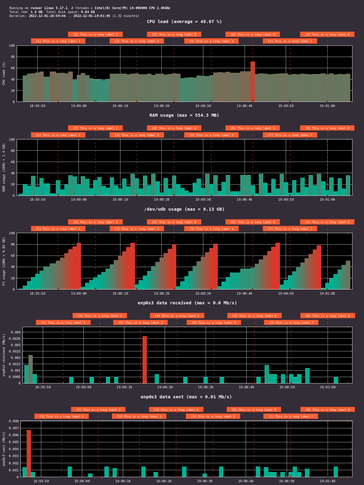

# sargraph

Copyright (c) 2019-2022 [Antmicro](https://www.antmicro.com)

This is a simple python tool that uses "sysstat" ("sar") to save information on CPU, RAM and disk usage.
The process runs in background and can be controlled with a set of sargraph sub-commands.

The tool can use "gnuplot" to optionally plot the data it collected.
Supported plot formats are PNG and SVG, they are determined by filenames.


# Example graph




# Usage
All sargraph commands use the following pattern:
```
$ ./sargraph.py [session_name] [command] [args...]
```

## Starting a session
Start a background session and name it `example`:
```
$ ./sargraph.py example start
```

The data will be saved in `example.txt`.
Logs from screen will be written to `example.log`.

## Adding a label
Add labels that will be placed as comments in the collected dataset.
They will be also visible on the plots:
```
$ ./sargraph.py example label "Compilation start"
```

## Plotting a running session
Plot data collected so far in a still running session:
```
$ ./sargraph.py example save plot.svg
```

## Plotting a closed session
Plot data collected in a session that is not running anymore.
```
$ ./sargraph.py example plot plot.png
```
The command requires the `example.txt` log file to be present in the working directory.

## Stopping a session
Stop a session and create a final `plot.png` plot file if no other plot was created so far:
```
$ ./sargraph.py example stop
```

The filename of the final plot can be changed if its placed after the `stop` command.
If the name is `none` then no plot will be created.

